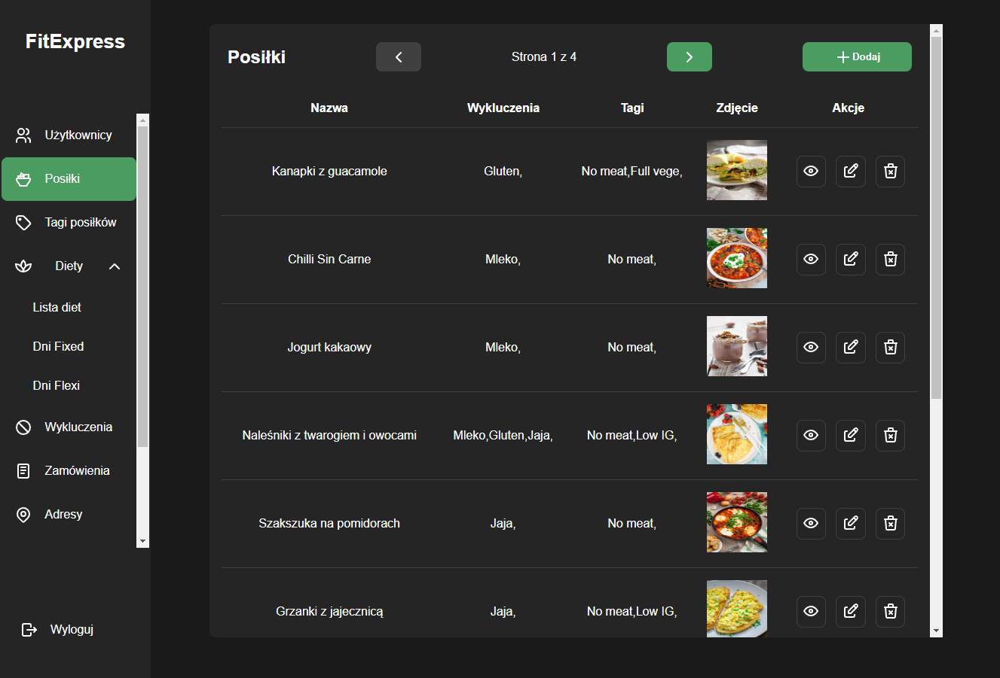
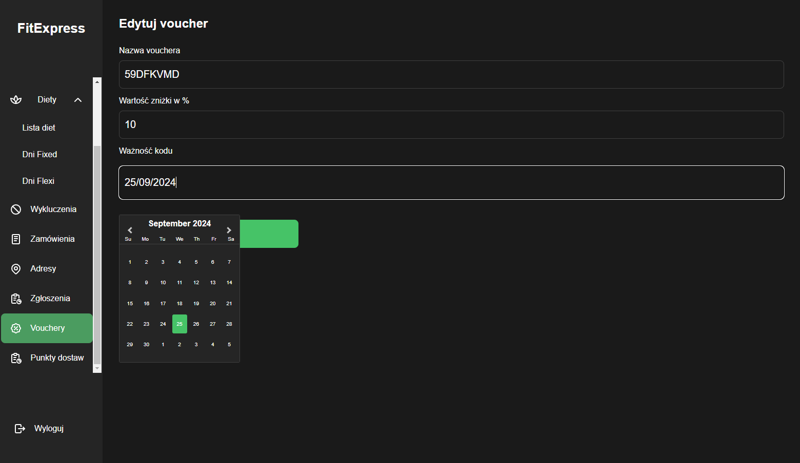
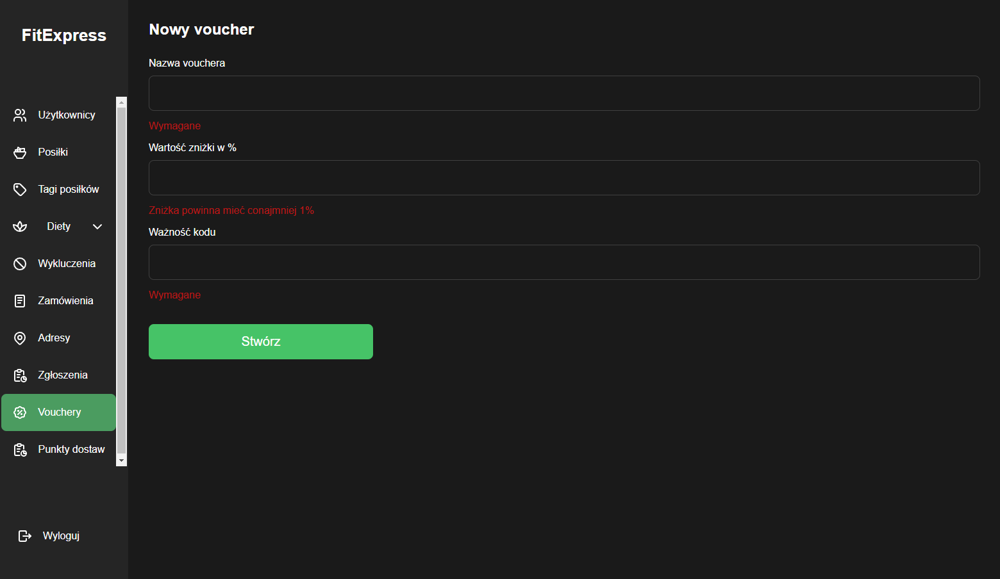

# FitExpress - a diet food catering service
This repository contains source code of the FitExpress app. To be precise, the admin panel for the FitExpress employees (check out the app repo [here](https://github.com/SquirrelloDev/FitExpress-front)).

FitExpress is a diet food catering service build with PWA capibilities which primary goal is to help the users to lose weight by providing the personalized plans.

The admin panel allows performing CRUD operations in much more convienent way.

**WARNING!** The live backend server is shut down. Any performed request is going to result with an error. Please refer to the [installation guide](#installation) to test the admin panel locally
## Table of Contents
- [Techstack](#techstack)
- [Features](#features)
- [Screenshots](#screenshots)
- [Instalation](#installation)
## Techstack
Technologies and libraries used for building the admin panel:
- React
- React hook form
- React hot-toast
- React loader spinner
- React-select
- React date-picker
- Tanstack react query
- Tanstack react table
- Zustand
- Axios
- TypeScript
- SCSS
- zod
## Features
- JWT based authentication only for the FitExpress employees
- Performing CRUD operations
- Pagination system
- Image upload
## Screenshots




## Installation
### Requirements
#### Technical requirements
- `node.js ver. >= 16.16.0` 
- `git`
#### Additional requirements
To work properly, the backend server should be running. The backend server repository is located [here](https://github.com/SquirrelloDev/FitExpress-back).
To test the API in dev enviroment, replace the ```endpointURL.prod``` to ```endpointURL.dev``` in the ```/src/utils/api.ts``` file
### Instruction
1. Clone the repository
```shell
git clone https://github.com/SquirrelloDev/FitExpress-admin.git
```
2. Install dependencies
```shell
npm install
```
3. Run the local server
```shell
npm run preview
```
